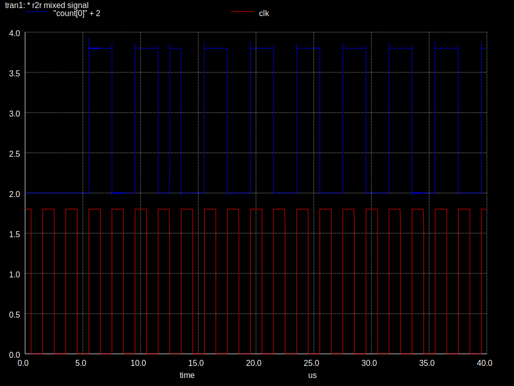

# Simulating a digital GDS with ngspice

I ran into an odd simulation issue when trying to simulate the spice extracted from an OpenLane generated
GDS.

The design is a [4 bit counter](verilog/count.v), and so on every other clock there should be a pulse on bit0 of the count. But occasionaly bit0 would toggle on the negative edge.

Neg edge toggle at 14us:

With help I tracked this down to 2 issues:

* Simulation time step was too long
* I was using the montecarlo corner, which introduces randomness

The [spice simulation](full_spice_sim.cir) is annotated. You can repeat the experiment by altering it and then using [run_10.sh](run_10.sh) to run it 10 times and plot the results.

# Results

* Checked with ngspice 42 and 43. 
* PDK was Sky130 installed at /home/matt/.volare/volare/sky130/versions/78b7bc32ddb4b6f14f76883c2e2dc5b5de9d1cbc

# montecarlo tt_mm corner

* works with [5n timestep](plots/mc/5ns)
* fails with [10n timestep](plots/mc/10ns)
* fails with [10n timestep and 2x slower clock](plots/mc/10ns)

## tt corner

* works with [5n timestep](plots/tt/5ns)
* works with [10n timestep](plots/tt/10ns)
* fails with [20n timestep](plots/tt/20ns)

# Building the spice from the Verilog

* Use OpenLane with the [config](openlane/r2r_dac_control/config.tcl) to create the GDS
* Open the resulting gds file in magic, and then run the following commands:

    extract all
    ext2sim labels on
    ext2sim
    extresist tolerance 10
    extresist
    ext2spice lvs
    ext2spice cthresh 0
    ext2spice extresist on
    ext2spice -o count.sim.spice

The result is [count.sim.spice](count.sim.spice)
